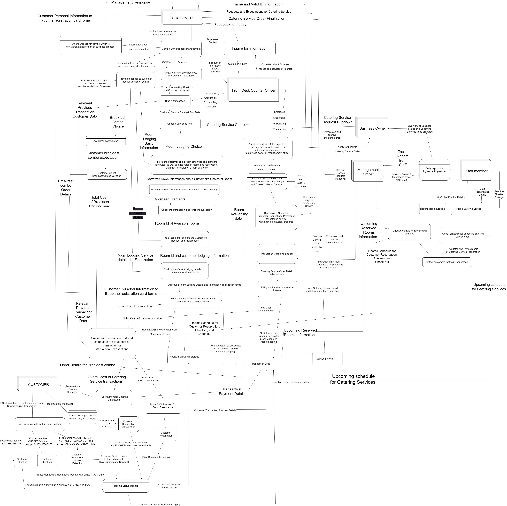

The Data Flow Diagram for the IT12L Project of the group of Naranjo, Richard, and Lim. 

I am not sure how to make a data flow diagram, I will just create the processes first then the data for 
each of the process will be labeled and connected to their own process later. 

Current progress with the Data Flow Diagram is 
around the process of creating the data flow for the 
room lodging check-in and out, as well as the payment for 
the services availed by the customer.

The SVG version of the current dfd exported with vscode extention.

Blurry png of the DFD but better than nothing since SVG won't 
be viewed on mobile.
